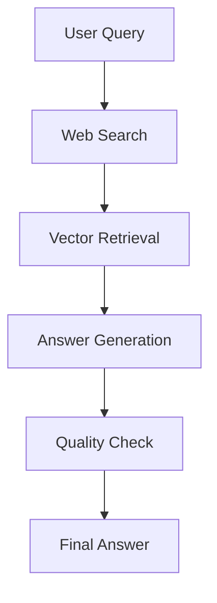

<p align="center">
  
</p>

---

# AI Engineering Hub 🚀
Welcome to the **AI Engineering Hub**!

## 🌟 Why This Repo?
AI Engineering is advancing rapidly, and staying at the forefront requires both deep understanding and hands-on experience. Here, you will find:
- In-depth tutorials on **LLMs and RAGs**
- Real-world **AI agent** applications
- Examples to implement, adapt, and scale in your projects

Whether you're a beginner, practitioner, or researcher, this repo provides resources for all skill levels to experiment and succeed in AI engineering.

---

## 📬 Stay Updated with Our Newsletter!
**Get a FREE Data Science eBook** 📖 with 150+ essential lessons in Data Science when you subscribe to our newsletter! Stay in the loop with the latest tutorials, insights, and exclusive resources. [Subscribe now!](https://join.dailydoseofds.com)

[](https://join.dailydoseofds.com)

---

## 📢 Contribute to the AI Engineering Hub!
We welcome contributors! Whether you want to add new tutorials, improve existing code, or report issues, your contributions make this community thrive. Here's how to get involved:
1. **Fork** the repository.
2. Create a new branch for your contribution.
3. Submit a **Pull Request** and describe the improvements.

---

## 📜 License
This repository is licensed under the MIT License - see the [LICENSE](LICENSE) file for details.

## 💬 Connect
For discussions, suggestions, and more, feel free to [create an issue](https://github.com/patchy631/ai-engineering/issues) or reach out directly!

Happy Coding! 🎉

# 🤖 LangGraph RAG Agent

A sophisticated Retrieval-Augmented Generation (RAG) agent built with LangGraph, featuring real-time web search and local knowledge base integration. This agent combines the power of OpenAI's language models with web search capabilities and document retrieval to provide accurate, up-to-date, and well-sourced answers.

## ✨ Features

- **🌐 Real-time Web Search**: Uses DuckDuckGo to fetch current information
- **📚 Local Knowledge Base**: Vector-based document retrieval using ChromaDB
- **🧠 LangGraph Workflow**: Stateful, multi-step processing pipeline
- **💬 Conversation Memory**: Maintains context across multiple queries
- **🔍 Quality Assessment**: Built-in answer quality evaluation
- **🖥️ Multiple Interfaces**: Streamlit web UI and command-line interface
- **⚙️ Configurable**: Customizable models, chunk sizes, and search parameters
- **📄 Document Management**: Support for text files and web URLs

## 🏗️ Architecture

The agent uses a LangGraph-based workflow with the following nodes:

1. **Web Search**: Searches the web for relevant information
2. **Vector Retrieval**: Finds similar documents in the knowledge base
3. **Answer Generation**: Combines retrieved information to generate responses
4. **Quality Check**: Evaluates the quality and completeness of answers



## 🚀 Quick Start

### Prerequisites

- Python 3.8+
- OpenAI API key

### Installation

1. **Clone the repository** (or use this directory):
   ```bash
   cd langgraph-rag-agent
   ```

2. **Install dependencies**:
   ```bash
   pip install -r requirements.txt
   ```

3. **Set up environment variables**:
   ```bash
   cp .env.example .env
   # Edit .env and add your OpenAI API key
   ```

4. **Run the Streamlit app**:
   ```bash
   streamlit run streamlit_app.py
   ```

   Or use the command line interface:
   ```bash
   python cli_app.py -i
   ```

## 📋 Usage Examples

### Streamlit Web Interface

1. Start the application:
   ```bash
   streamlit run streamlit_app.py
   ```

2. Open your browser to `http://localhost:8501`
3. Enter your OpenAI API key in the sidebar
4. Click "Initialize Agent"
5. Start asking questions!

### Command Line Interface

**Interactive mode**:
```bash
python cli_app.py -i
```

**Single query**:
```bash
python cli_app.py -q "What are the latest developments in AI?"
```

**Add documents from files**:
```bash
python cli_app.py -f document1.txt document2.txt -i
```

**Add documents from URLs**:
```bash
python cli_app.py -u https://example.com/article1 https://example.com/article2 -i
```

### Python API

```python
import asyncio
from langgraph_rag_agent import LangGraphRAGAgent, RAGConfig

# Initialize the agent
config = RAGConfig(openai_api_key="your-api-key")
agent = LangGraphRAGAgent(config)

# Add documents
agent.add_documents([
    "LangGraph is a framework for building stateful AI applications...",
    "RAG combines retrieval with generation for better AI responses..."
])

# Query the agent
async def main():
    result = await agent.query("What is LangGraph?")
    print(result["answer"])

asyncio.run(main())
```

## ⚙️ Configuration

### Environment Variables

Create a `.env` file based on `.env.example`:

```env
OPENAI_API_KEY=your_openai_api_key_here
OPENAI_MODEL=gpt-4o-mini
EMBEDDING_MODEL=text-embedding-3-small
CHUNK_SIZE=1000
CHUNK_OVERLAP=200
MAX_SEARCH_RESULTS=5
VECTOR_DB_PATH=./chroma_db
```

### RAGConfig Parameters

- `openai_api_key`: Your OpenAI API key
- `model_name`: OpenAI chat model (default: "gpt-4o-mini")
- `embedding_model`: OpenAI embedding model (default: "text-embedding-3-small")
- `chunk_size`: Document chunk size (default: 1000)
- `chunk_overlap`: Overlap between chunks (default: 200)
- `max_search_results`: Maximum web search results (default: 5)
- `vector_db_path`: Path to ChromaDB storage (default: "./chroma_db")

## 📁 Project Structure

```
langgraph-rag-agent/
├── langgraph_rag_agent.py    # Main RAG agent implementation
├── streamlit_app.py          # Streamlit web interface
├── cli_app.py               # Command line interface
├── requirements.txt         # Python dependencies
├── .env.example            # Environment variables template
├── README.md               # This file
└── chroma_db/              # Vector database (created automatically)
```

## 🔧 Advanced Usage

### Custom Document Processing

```python
# Add documents with metadata
agent.add_documents(
    documents=["Document content..."],
    metadatas=[{"source": "custom", "type": "manual"}]
)

# Add documents from URLs
agent.add_documents_from_urls([
    "https://example.com/article1",
    "https://example.com/article2"
])
```

### Conversation with History

```python
conversation_history = [
    {"human": "What is AI?", "assistant": "AI is..."},
    {"human": "How does it work?", "assistant": "It works by..."}
]

result = await agent.query(
    "Can you elaborate on that?", 
    conversation_history=conversation_history
)
```

### Quality Assessment

The agent includes automatic quality assessment with the following metrics:

- **Answer Length**: Checks if the answer is sufficiently detailed
- **Query Relevance**: Measures how well the answer addresses the question
- **Error Detection**: Identifies potential errors or issues

## 🛠️ Development

### Running Tests

```bash
# Test the basic functionality
python langgraph_rag_agent.py
```

### Adding New Features

The modular design makes it easy to extend:

1. **Add new search engines**: Modify the `_web_search_node`
2. **Enhance quality checks**: Extend the `_quality_check_node`
3. **Add new document formats**: Create custom document loaders
4. **Integrate new LLMs**: Modify the `RAGConfig` and initialization

## 📊 Performance

The agent provides detailed metadata for each query:

- Number of web search results found
- Number of documents retrieved from vector store
- Quality score (0-3)
- Processing time and potential issues

## 🔒 Security and Privacy

- API keys are handled securely through environment variables
- Local vector database ensures document privacy
- Web search results are processed locally
- No conversation data is stored permanently (unless explicitly saved)

## 📝 License

This project is open source and available under the MIT License.

## 🤝 Contributing

Contributions are welcome! Please feel free to submit pull requests or open issues for bugs and feature requests.

## 📚 Dependencies

Key dependencies include:

- **LangChain & LangGraph**: Core AI framework
- **OpenAI**: Language models and embeddings
- **ChromaDB**: Vector database
- **Streamlit**: Web interface
- **DuckDuckGo Search**: Web search functionality
- **Beautiful Soup**: Web scraping

## 🆘 Troubleshooting

### Common Issues

1. **"OpenAI API key not found"**
   - Ensure your `.env` file contains `OPENAI_API_KEY=your-key`
   - Check that the `.env` file is in the correct directory

2. **"No web search results"**
   - Check your internet connection
   - The search service might be temporarily unavailable

3. **"Vector store is empty"**
   - Add documents using the web interface or CLI
   - Ensure documents are properly formatted

4. **Streamlit not loading**
   - Make sure all dependencies are installed
   - Try restarting the Streamlit server

### Getting Help

- Check the console output for detailed error messages
- Use the `--help` flag with the CLI for command options
- Review the configuration settings in your `.env` file

## 🔄 Updates and Roadmap

Future enhancements planned:

- [ ] Support for more document formats (PDF, DOCX, etc.)
- [ ] Multiple search engine integration
- [ ] Advanced conversation management
- [ ] API endpoint deployment
- [ ] Performance optimization
- [ ] Enhanced quality metrics

---

**Happy querying! 🚀**
